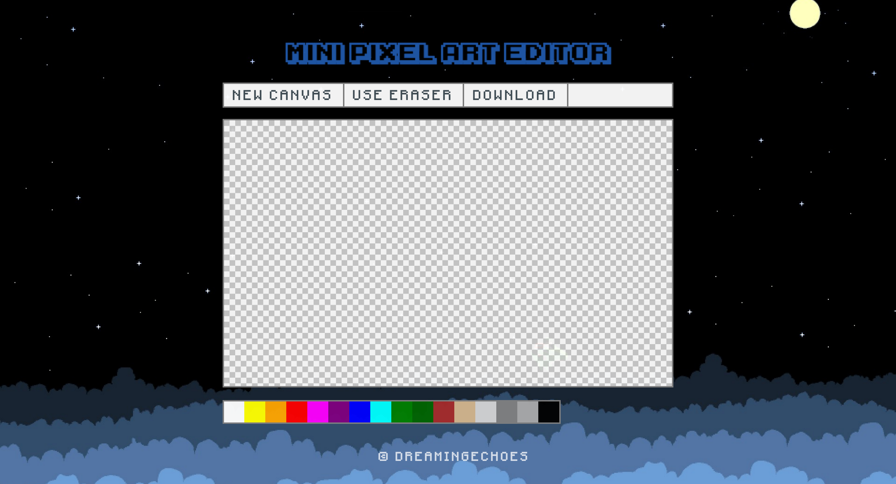

# MiniPixelArtEditor

## About

MiniPixelArtEditor is a (work in progress) simple pixel art editor made with [Middleman](https://middlemanapp.com/) and jQuery.



## Usage

To use this editor, first you have to install **Middleman** in order to be able to initialize a server. Just follow the instructions provided [here](https://middlemanapp.com/basics/install/).

Then, you're ready to go, simply execute this on your terminal:

```sh
user@computer:~$ git clone git@github.com:dreamingechoes/mini-pixel-art-editor.git
user@computer:~$ cd mini-pixel-art-editor
user@computer:/mini-pixel-art-editor$ middleman serve
```

## TO-DO

- Finish the jQuery library that handles all the behaviour of the editor.

## Contributing

Bug reports and pull requests are welcome on GitHub at https://github.com/dreamingechoes/mini-pixel-art-editor. This project is intended to be a safe, welcoming space for collaboration, and contributors are expected to adhere to the [Contributor Covenant](contributor-covenant.org) code of conduct.

## License

**MiniPixelArtEditor** is released under the terms of the [MIT License](http://opensource.org/licenses/MIT).
